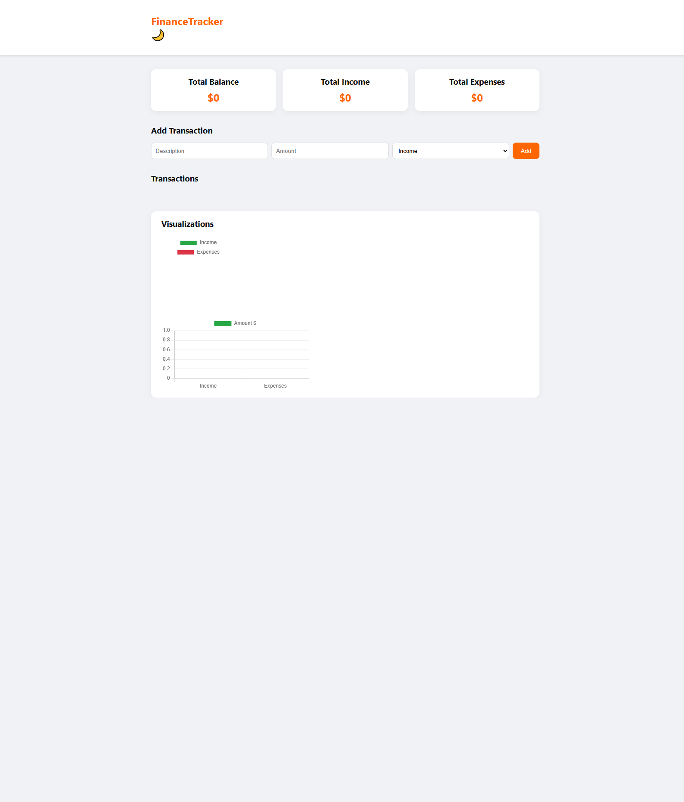

# Personal Finance Tracker

A modern **personal finance tracker** built for **Ramesh R** to manage daily expenses and income with interactive charts.

## ✨ Features
- Add, edit, and delete transactions
- Categorize transactions (Food, Travel, Salary, Bills, etc.)
- Monthly summary of income and expenses
- Interactive Pie Chart & Bar Chart (using Chart.js)
- Dark/Light mode toggle
- Saves data using localStorage

## 🛠️ Tech Stack
- HTML
- CSS
- JavaScript
- Chart.js (for data visualization)
- LocalStorage (for persistence)

## 📸 Screenshots


## 🚀 How to Use
1. Clone the repository:
   ```bash
   git clone https://github.com/ramesh-852000/personal-finance-tracker.git
